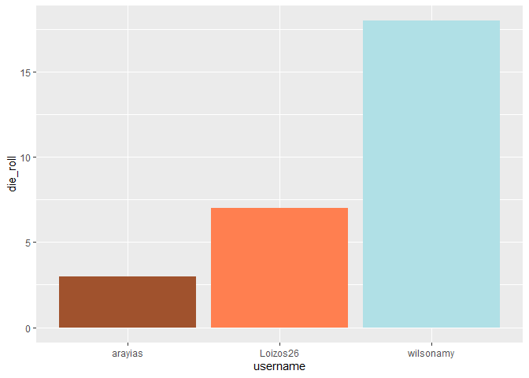
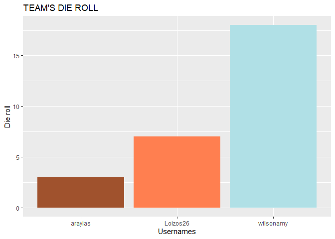
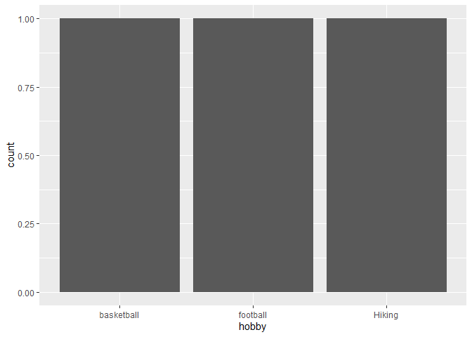

Lab 00 - Hello IDS!
================
THE GOOD TEAM
2022-09-23

### Load packages and data

``` r
library(tidyverse) 
```

### Exercises 13–17

We set up the data frame.

``` r
usernames <- c("wilsonamy", "arayias", "Loizos26") #Extend if necessary
nums <- c(18, 3, 7) #Extend if necessary
colours <- c("powderblue", "sienna", "coral") #Extend if necessary
hobbies <- c("Hiking", "football", "basketball") #Extend if necessary

team_data <- tibble(username = usernames, die_roll = nums, colour = colours,
                    hobby = hobbies)
```

### Exercise 18

We now work on visualising our data.

``` r
# Uncomment the three lines below
p1 <- ggplot(team_data, aes(x = username, y = die_roll)) +
   geom_col(fill = team_data$colour)
 p1
```

<!-- -->

### Exercise 19

The above plot shows the die roll of every team member and each person’s
bar is in the colour the chose.

### Exercises 20–21

``` r
# Uncomment the three lines below
 p1 +
   labs(x = "Usernames", y = "Die roll",
        title = "TEAM'S DIE ROLL")
```

<!-- -->

We added a title to the plot and changed the x and y labels

### Exercise 22

``` r
p2 <- ggplot(team_data, aes(x = hobby)) +
  geom_bar()
p2
```

<!-- -->

The plot isn’t a good visualisation, because if you extended it to
everyone taking this we would probably not have many overlaping hobbies.
Instead of giving the option for everyone to write their exact hobby we
can group them (e.g. outdoor activities) or give a selection of hobbies.
